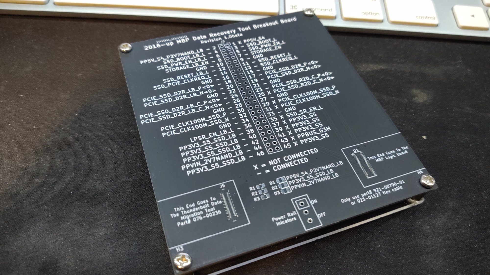

## Mac Tools
This is a repository of tools we designed to help repair Mac computers

### MBP 2016-up Data Recovery Breakout Adapter
#### WARNING! This design has not been tested, proceed at your own risk.
This board is designed to connect a Mac data migration tool to MacBook boards that do not have a lifeboat connector for data recovery. The idea is to run a wire from each of the breakout pins to the same or similar points on the MacBook board you are trying to recover, then use the migration tool to recover the data. The connector on the left connects to the data migration tool and uses the same lifeboat connector that would be found on a 2016-17 MBP board (same as the female LCD connector for a 2016-17 MBP also known as a Novastack HDP-35 42pin connector). The right connector (same as a female iPad Air/5 LCD connector) gives you the ability to use this breakout as a passthrough to a board the has a lifeboat connector for the purpose of probing the migration tool to see what it's doing when migrating data from a macBook with a lifeboat connector. The indicator LED's are a visual status indicator for the different power rails, this might be useful for debugging or checking to see what the startup sequence looks like when using the migration tool. They can be disconnected using the switch or you don't have to solder them if not desired. The schematic and board layout was designed in Kicad.

